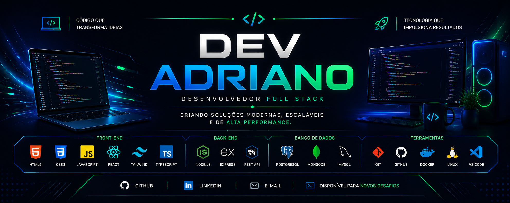

  

# 👋 Olá, eu sou o Dev Script Adriano

## 💻 Desenvolvedor Full Stack

  

Sou desenvolvedor Full Stack apaixonado por tecnologia e pela criação de aplicações modernas, escaláveis e de alta performance.

  
  

### 🚀 Tecnologias

#### Front-end
- HTML5
- CSS3
- JavaScript
- TypeScript
- React
- Tailwind CSS

#### Back-end
- Node.js
- Express
- APIs REST

#### Mobile
- Java
- Kotlin
- Android

#### Banco de Dados
- PostgreSQL
- MongoDB
- MySQL

#### Ferramentas
- Git
- GitHub
- Docker
- Linux
- VS Code

---

### 📫 Contato

- GitHub: https://github.com/adrianobalaxx-gif

> Sempre buscando aprender novas tecnologias e desenvolver soluções que fazem a diferença.
